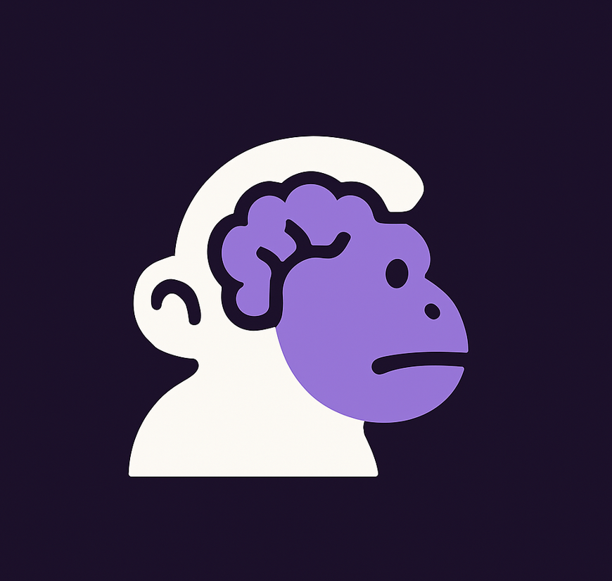
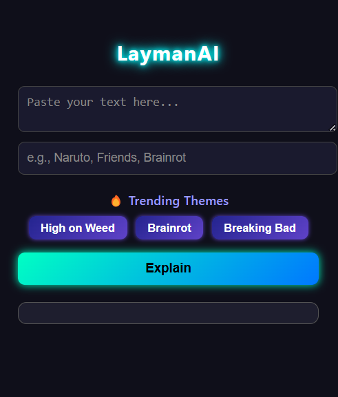

# LaymanAI

LaymanAI is an innovative browser extension and backend service designed to transform complex information into simple, engaging, and easy-to-understand explanations. Whether you're a student, a professional, or just someone curious about learning, LaymanAI helps you retain and comprehend difficult concepts effortlessly.



---

## Why LaymanAI?

In a world overflowing with information, understanding complex topics can be overwhelming. LaymanAI bridges the gap by breaking down intricate content into digestible insights, tailored to your preferred style or theme. It’s like having a personal tutor who speaks your language—literally.

---

## Features

- **Simplified Explanations**: Converts dense, technical content into fun, relatable, and easy-to-grasp summaries.
- **Customizable Themes**: Choose from trending themes or create your own to make learning more enjoyable.
- **Daily Usage Limits**: Ensures fair usage with a cap of 5 explanations per day.
- **User-Friendly Interface**: A sleek and intuitive browser extension for seamless interaction.



---

## Project Structure

```
LaymanAI/
├── client/          # Frontend browser extension
│   ├── popup.html   # Main extension popup
│   ├── popup.js     # JavaScript logic for the extension
│   ├── styles.css   # Styling for the extension
│   └── manifest.json # Chrome extension manifest
├── server/          # Backend server
│   ├── server.js    # Express server handling API requests
│   ├── .env         # Environment variables (ignored in Git)
│   └── package.json # Node.js dependencies and scripts
└── README.md        # Project documentation
```

---

## Setup Instructions

### Prerequisites

- **Node.js**: Install [Node.js](https://nodejs.org/) (v14 or higher).
- **npm**: Comes with Node.js for managing dependencies.

### Backend Setup

1. Navigate to the `server` directory:
   ```bash
   cd server
   ```

2. Install dependencies:
   ```bash
   npm install
   ```

3. Create a `.env` file in the `server` directory with the following content:
   ```env
   API_KEY=your_api_key_here
   PORT=5500
   ```

4. Start the server:
   ```bash
   npm start
   ```

   The server will run on `http://localhost:5500`.

---

### Frontend Setup

1. Load the extension in your browser:
   - Open Chrome and navigate to `chrome://extensions/`.
   - Enable **Developer Mode**.
   - Click **Load unpacked** and select the `client` directory.

2. Use the extension by clicking on the LaymanAI icon in the browser toolbar.

---

## Usage

1. Open the LaymanAI extension.
2. Paste the text you want to simplify in the input box.
3. Choose a theme or enter a custom theme.
4. Click **Explain** to receive a concise, engaging explanation.

---

## How It Works

LaymanAI leverages advanced natural language processing techniques to analyze and simplify content. By focusing on clarity and relatability, it ensures that even the most challenging topics become accessible and memorable. The customizable themes add a layer of personalization, making learning not just effective but also fun.

---

## Environment Variables

The `.env` file in the `server` directory should contain:

- `GEMINI_API_KEY`: Your API key for generating explanations.
- `PORT`: The port on which the backend server runs (default: 5500).

---

## Dependencies

### Backend

- `express`: Web framework for Node.js.
- `cors`: Middleware for enabling CORS.
- `dotenv`: For managing environment variables.
- `node-fetch`: For making HTTP requests.
- `express-rate-limit`: For rate-limiting API requests.

### Frontend

- Chrome Extension APIs.

---

## Who Is It For?

LaymanAI is perfect for:

- **Students**: Simplify textbooks, research papers, or lecture notes.
- **Professionals**: Break down technical documents or reports.
- **Lifelong Learners**: Understand any topic without feeling overwhelmed.

---

## License

This project is licensed under the MIT License.
